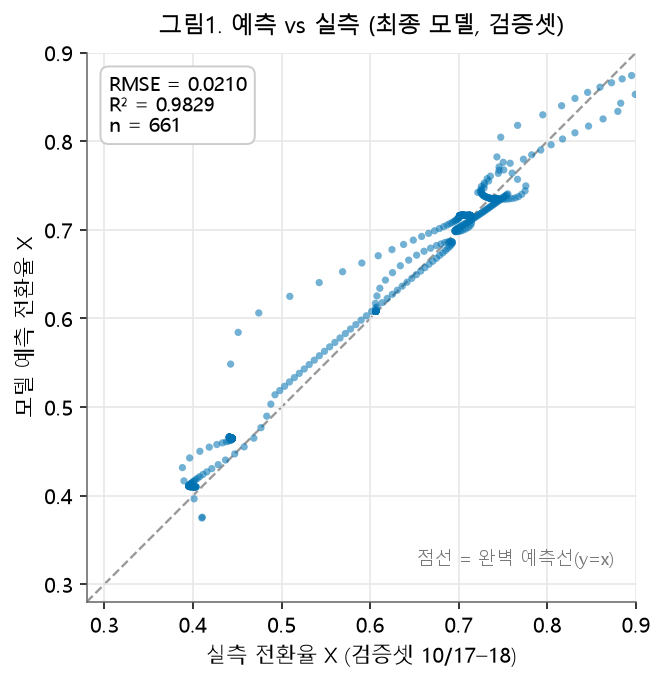
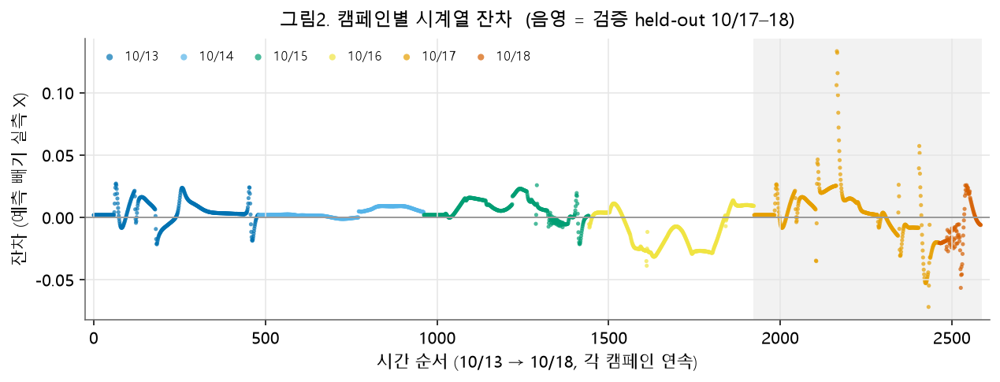
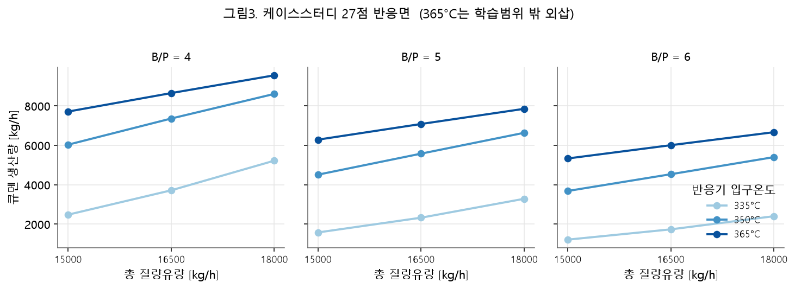

# §3.3-1 모델 선정 근거 — 본문 초안 (Stage 5)

> 목차 4.3 / 내부 §3.3-1 "왜 이 모델을 골랐나"의 보고서 본문 초안. Stage 0~4 결과를 종합한다.
> 모든 수치는 `results/` 에서 재현된 값이며 표기 [주어짐]/[계산]/[가정]. 상세표는 부록 링크.
> 이 연구가 훑은 범위: 모델족 **22종** × 타깃변환 **5종** × 입출력 세트 및 케이스스터디 **27점** 격자를
> 하나의 평가 규약으로 비교했다 — 개수를 늘린 것이 아니라, 아래처럼 **원칙으로 후보를 좁힌** 것이다.

---

## 1. 먼저 "무엇으로 잴 것인가"를 정했다

모델을 고르기 전에 평가 규약을 먼저 고정했다. 이것이 없으면 어떤 비교도 숫자놀음이 된다.

- **무작위 분할을 쓰지 않는다.** 데이터는 1분 간격 시계열이라 이웃 시점이 거의 같은 값이다. 아무렇게나
  섞어 나누면 같은 운전점이 학습·시험에 함께 들어가 성능이 부풀려진다(잔차 자기상관 1분 지연 **0.955**,
  60분 지연에도 **0.33** 잔존) [계산]. 그래서 분할은 **캠페인(날짜) 단위**로만 한다.
- **검증 캠페인(10/17–18)은 최종 확인 1회에만** 쓴다. 모델·하이퍼파라미터 선택은 학습 캠페인
  안에서 "각 캠페인 뒤 20% 시간 구간"(**블록20%**)으로만 정한다. 승자 결정은 블록20% 로만 하고,
  검증 RMSE 는 확인용으로만 본다(검증셋 반복 사용 이력은 `results/validation_usage_log.md` 에 누적) [설계].
- **불확실성은 난수 없는 블록 잭나이프로** 재고(60·120분), 블록 부트스트랩으로 교차확인한다.
- 성능과 **별개로 물리 타당성**(예측이 0~1 안에 있는가)을 검사한다.

이 규약 자체가 §3.3-3 의 답이며, 상세는 `docs/Stage0_평가프로토콜.md`.

## 2. 단순→복잡으로 훑었더니, 성능 1등이 곧 채택은 아니었다

선형(1차·다항·Ridge·Lasso·ElasticNet·PLS)부터 거리·커널(KNN·SVR·가우시안 과정), 트리·부스팅
(RandomForest·ExtraTrees·GradientBoosting·HistGB·AdaBoost), 신경망(MLP)까지 22종을 같은 규약으로
비교했다(전체 표는 `docs/Stage1_모델족비교.md`). 검증 상위권은 전부 **선형 계열**이었고, 트리·거리·
신경망 계열은 검증 RMSE 0.06~0.16 으로 뚜렷이 나빴다 [계산].

그런데 여기서 **반례**가 나왔다. 3차 다항 모델은 내부검증(블록20%)에서 11위로 멀쩡해 보였지만,
케이스스터디 상한 온도에서 **예측이 발산**해 검증 RMSE 22위(0.377)로 무너졌다.

> **반례 (표 A).** 3차 다항: 블록20% **0.00979**(11위) → 검증 **0.377**(22위), 큐멘 오차 **56%** [계산].
> 원인은 과적합이 아니라 **외삽**이다 — 케이스스터디 최고 온도 **365°C** 는 학습셋 최고 온도
> **349.977°C** [계산]를 넘는데, 고차 다항은 학습 범위 밖에서 급격히 치솟는다.

즉 "내부검증 숫자가 좋다"가 "쓸 수 있다"를 보장하지 않는다. 이 사실이 선정 기준을 넓히게 만들었다.

## 3. 그래서 성능 하나가 아니라 네 가지로 골랐다

케이스스터디는 학습 범위를 벗어난 조건(365°C)을 요구한다 [주어짐, rev2 §3.3-6]. 반응기를 대체할
모델은 그런 **외삽에서도 물리적으로 말이 되는 값**을 내야 하고, ONNX 로 시뮬레이터에 실을 수 있어야
한다. 그래서 다음 네 가지를 함께 봤다.

1. **물리적 안전성** — 전환율은 정의상 0~1 이다. 타깃을 **로짓으로 변환**하면 모델이 구조적으로 (0,1)
   안에만 답한다. 27점 격자에서 변환별 범위 이탈 개수: 그대로 **9.0**/27, 로그 8.4, **로짓 0.0** [계산]
   (`docs/Stage2_타깃변환.md`). 로짓은 학습 범위 밖 365°C 에서도 27/27 을 지켰다.
2. **외삽 강건성** — 위 반례(3차 다항)처럼 학습 범위 밖에서 발산하지 않아야 한다. 1차·2차 선형은
   유계를 유지했다.
3. **ONNX 변환 가능** — 대회 §3.1 요구. 최종 후보는 회귀식 + Sigmoid 한 노드로 변환돼 파이썬 예측과
   최대 절대차 ≤ 2e-6 로 일치했다 [계산]. (Dummy·HistGB 등은 변환 실패 → 배포 불가.)
4. **캠페인 민감도(공선성 대신)** — 학습 캠페인 하나를 빼도 예측이 크게 흔들리지 않아야 한다.

이 네 기준은 성능 순위와 **독립적으로** 후보를 걸러낸다. Stage 4(18칸 격자)에서 확인했듯, 성능 순위는
입력을 바꾸면 흔들리지만(Spearman 검증 **+0.283**) **로짓은 전 칸에서 물리 27/27·9/9 를 유지**해
선택을 안정시켰다 [계산] (`docs/Stage4_상호작용확인.md`).

## 4. 최종 후보와 판단

네 기준을 통과한 것은 **선형 + 로짓** 계열이다. 그 안에서 세 후보가 남았고, 셋은 잭나이프 기준 서로
**통계적으로 동률**이다(검증 RMSE 차의 95% 구간이 0 을 포함).

**표1. 최종 후보 비교 (입력 I1, 타깃 로짓, 검증 10/17–18)** [계산]

| 후보 | 파라미터 | 블록20%(선택) | 검증 RMSE(확인) | 큐멘 오차 | LOCO-5 강건성(평균/최악) | 캠페인 민감도 | 물리·ONNX |
|---|---|---|---|---|---|---|---|
| **1차 로짓 선형**(현 배포) | 4 | 0.00837 | 0.020987 | 3.05% | **0.060 / 0.196** | **0.094** | 27/27·9/9 · O |
| Ridge 2차 로짓 | 10 | **0.00741** | **0.019293** | 2.80% | 0.103 / 0.465 | 0.372 | 27/27·9/9 · O |
| 2차 로짓 선형 | 10 | 0.00746 | 0.021109 | 3.11% | 0.157 / 0.487 | 0.377 | 27/27·9/9 · O |

- **정확도로는 Ridge 2차**가 근소하게 앞선다(블록20% 최소, 검증 0.0193). 물리·ONNX 도 통과한다.
- 그러나 **1차 선형이 훨씬 단순하고 강건하다**: 파라미터 4개, 캠페인 하나를 빼도 예측 이동이 **0.094**
  로 다항 모델(0.37)의 1/4 수준이고, LOCO-5 최악값도 0.196 대 0.465 로 절반 이하다 [계산]. 세 후보의
  검증 차이는 통계적으로 구분되지 않으므로(잭나이프 동률), **정확도 근소 우위만으로 배포 모델을 바꿀
  근거는 약하다.**
- 입력·출력도 함께 검증했다(§3.3-2, `docs/Stage3_입출력변수.md`): **압력 변수는 성능이 좋아 보여도
  케이스스터디가 압력을 지정하지 않고 반응기 압력이 시뮬레이터의 계산 결과라 순환이 생겨 제외**했고
  (VIF 검증셋 901), **출력은 전환율을 예측해 환산하는 편이 큐멘을 직접 예측하는 것보다 약 3배 정확**
  (2.80% vs 9.27%)했다 [계산].

**최종 모델의 그림 근거:** 예측이 실측 대각선에 붙고(그림1, R² **0.983**), 잔차는 대부분 0 근처이며
온도가 급변하는 과도 구간에서만 커진다(그림2). 케이스스터디 27점에서 온도↑·유량↑에 따라 큐멘
생산량이 물리적으로 옳게 증가한다(그림3).

---

## 부록 표 (§3.3-2 / §3.3-3 요약)

**표2. 입출력 변수 선정 근거(요약)** — 상세 `docs/Stage3_입출력변수.md`

| 항목 | 결정 | 근거 |
|---|---|---|
| 입력 | I1 [입구온도·프로펜유량·B/P비] 유지 | 총유량(I1b)은 다항 모델만 이득·배포본엔 악화(Stage 4) |
| 압력(PT-1004/1100) 제외 | 성능 무관 제외 | 케이스스터디 미지정·순환 의존·VIF 19.7~901·계수 부호 반전 |
| 출력 | 전환율 X 예측 후 환산 | 직접 예측보다 3배 정확(2.80% vs 9.27%) |

**표3. 지표·평가 프로토콜(요약)** — 상세 `docs/Stage0_평가프로토콜.md`

| 요소 | 방식 |
|---|---|
| 분할 | 캠페인 단위(학습 10/13–16 → 검증 10/17–18), 무작위 금지, 검증 1회 |
| 튜닝·선택 | 블록20%(캠페인 내 뒤 20% 시간구간) |
| 지표 | 전환율 RMSE/MAE/MAPE/R²/최대오차 + 큐멘 kg/h(=X×프로펜몰유량×120.196) |
| 불확실성 | 블록 잭나이프 60/120분(주) + 부트스트랩(교차) |
| 물리 검사 | 27점 격자에서 0~1 범위·온도 단조성·외삽 유계 |

---

## 보고서용 설명

**1) 이 Stage 가 답하는 항목:** 목차 4.3 / 내부 §3.3-1 — "왜 이 모델을 골랐나"(§3.3-2·3.3-3 요약 포함).

**2) 무엇을 왜 했는지:** 반응기의 속도식을 모르니 ML 로 반응기를 대체하는데, "제일 잘 맞는 모델 하나"를
고르는 게 아니라 "원칙 있는 기준으로 좁혔다"를 보이는 것이 목적이다. 그래서 먼저 평가 규약(캠페인 분할·
검증 1회·블록20% 선택)을 세우고, 22개 모델을 훑되 성능 1등이 곧 채택이 아님을 반례로 보인 뒤, 물리
안전성·외삽 강건성·ONNX 변환·캠페인 민감도라는 네 기준으로 후보를 걸러 선형+로짓 계열을 남겼다.

**3) 핵심 수치:** 최종 후보 검증 RMSE — 1차 로짓 **0.020987**, Ridge 2차 **0.019293**, 2차 **0.021109**(셋 잭나이프
동률) [계산]. R² **0.983**, 큐멘 오차 **2.8~3.1%** [계산]. 로짓 변환 격자 범위이탈 **0/27**, 그대로 9/27 [계산].
큐멘 kg/h = X × 프로펜몰유량 × **120.196**[주어짐] (프로펜몰유량 = **0.94773**[계산]×FT-1004/**42.081**[주어짐]).
학습 최고 온도 **349.977°C**, 케이스 상한 **365°C**(외삽)[주어짐/계산].

**4) 예상과 달랐던 점(반례):** (i) 3차 다항은 내부검증 11위인데 외삽에서 발산해 검증 22위(0.377). (ii) 압력
변수는 내부검증을 낮추지만 검증(외삽)을 악화시키고 케이스스터디에서 지정 불가라 제외. (iii) 정확도 1위
(Ridge 2차)가 강건성에서는 1차 선형(캠페인 민감도 0.094 vs 0.372)에 크게 뒤진다. 이 세 반례가 "성능
숫자 하나로 모델을 고르면 안 된다"는 논리의 핵심 근거다.

**5) 재현 안 된 값:** 현재 배포본은 **1차 로짓 선형(held-out 0.020987)**이며, 앞선 인수인계 문서의
"Poly2/0.02111" 표기는 부정확해 재현값을 따랐다(ONNX 노드 = LinearRegressor+Sigmoid). 목록은
`results/stage1_비재현목록.md`.
